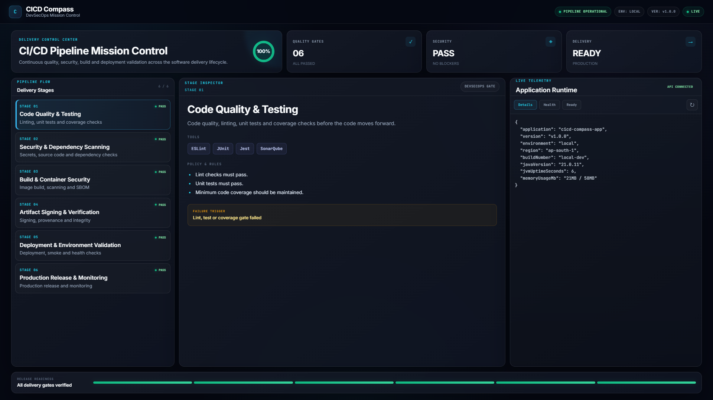

# 🚀 CICD Compass

> **Enterprise DevSecOps Architecture, Automated CI/CD Blueprints & Live Telemetry Engine**

CICD Compass is a production-grade educational and reference DevSecOps application built with **Spring Boot (Java 21)** and an interactive, dark-themed **Mission Control Dashboard**. It models and visualizes the 6 critical stages of an enterprise CI/CD delivery lifecycle alongside live runtime telemetry probes.


---

## 🌟 Key Features

* **Interactive Mission Control Dashboard:** Responsive, viewport-optimized (`100vh`) UI styled with dark-mode glassmorphism and real-time stage inspection.
* **6-Stage DevSecOps Pipeline Blueprint:**
  1. **Stage 01:** Quality, Lint & Automated Tests (Shift-Left validation)
  2. **Stage 02:** Secrets Scanning & SCA Audit (Gitleaks, dependency vulnerability gate)
  3. **Stage 03:** Container Build & Trivy Scan (Minimal layer builds, rootfs CVE scan, SPDX SBOM generation)
  4. **Stage 04:** Image Provenance & Signing (Keyless Sigstore Cosign via GitHub OIDC tokens)
  5. **Stage 05:** Ephemeral Staging Smoke Test (Runner-level container execution & curl retry probes)
  6. **Stage 06:** Production Immutable Delivery (Zero-drift sha256 artifact delivery)
* **Live Health & Telemetry Probes:** Exposes liveness, readiness, and runtime system metrics.
* **Structured Boot Logging:** Emits a 5-line startup console summary capturing JVM uptime, ports, and probe endpoints.

---

## 🛠️ Technology Stack

* **Backend:** Java 21, Spring Boot 3.3.3 (Spring Web)
* **Frontend:** Vanilla HTML5, Modern CSS3 (CSS Variables, Flexbox, Grid), Vanilla JavaScript (ES6)
* **Build System:** Apache Maven
* **Runtime Target:** Docker Multi-stage builds, Distroless / Alpine base images

---

## 🚀 Quick Start (Local Run)

### Prerequisites
* Java 21 JDK installed
* Apache Maven 3.8+ installed

### Build & Run
```bash
# Clone the repository
git clone https://github.com/<YOUR_GITHUB_USERNAME>/cicd-compass-app.git
cd cicd-compass-app

# Compile and start the application
mvn clean spring-boot:run
```

Once initialized, access the dashboard in your browser:
👉 **`http://localhost:8080`**

---

## 📡 API Endpoints & Health Probes

| Endpoint | HTTP Method | Target Gate | Description |
| :--- | :---: | :--- | :--- |
| `/api/health` | `GET` | Container Liveness | Verifies application process health and timestamp. |
| `/api/ready` | `GET` | Container Readiness | Verifies if the service is ready to accept incoming traffic. |
| `/api/details` | `GET` | Telemetry & Metadata | Returns environment details, active version, region, and JVM memory stats. |

### Sample Response (`/api/details`):
```json
{
  "application": "cicd-compass-app",
  "version": "v1.0.0",
  "environment": "local",
  "region": "ap-south-1",
  "buildNumber": "local-dev",
  "javaVersion": "21.0.11",
  "jvmUptimeSeconds": 42,
  "memoryUsageMb": "28MB / 58MB"
}
```

---

## ⚡️ Configuration & Environment Variables

All telemetry values can be overridden dynamically at runtime using environment variables:

```bash
export APP_NAME="cicd-compass-prod"
export APP_ENV="production"
export APP_REGION="ap-south-1"
export APP_VERSION="v1.0.0"
export APP_BUILD_NUMBER="build-1042"
```

---

## 🔒 Security Gate Integration Guidelines

* **Gitleaks:** Run with `fetch-depth: 0` to scan git commit histories for exposed tokens and private keys.
* **Trivy Image Scan:** Scan container images with severity thresholds set to `--severity HIGH,CRITICAL --exit-code 1`.
* **Cosign Keyless Signing:** Sign published container images using ephemeral OIDC tokens provided by GitHub Actions runner workflows.
* **Immutable Deployments:** Always pin deployed container instances to an immutable digest (`sha256:...`) instead of mutable tags (`:latest`).

---

## 📄 License

This project is licensed under the MIT License - see the LICENSE file for details.

---
